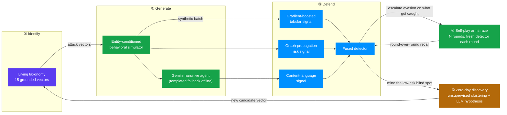

# Ouroboros

**The attack and the defense, trained in the same loop.**

[](https://github.com/KushalChunduru/ouroboros-genai-fraud-defense-loop)
[](https://nextjs.org)
[](https://fastapi.tiangolo.com)
[](https://scikit-learn.org)
[](https://www.typescriptlang.org)
[](#data--privacy)

A closed-loop AI system for GenAI-era payment fraud. It **identifies** emerging attack vectors grounded in named 2026 threat reporting, **generates** high-fidelity behavioral simulations of them at scale, and **defends** with a fused detector — then runs the whole system as a self-play arms race and a zero-day discovery agent, so the defender's own blind spots become tomorrow's attack hypotheses.

Live console: five connected pages (`/console` → `/console/generate` → `/console/self-play` → `/console/zero-day` → `/console/summary`), one shared run, real backend calls throughout — no mocked data anywhere in the demo path.

See [`docs/DESIGN.md`](docs/DESIGN.md) for the UI/UX research and decision log behind the frontend, and [`docs/Ouroboros_Solution_Walkthrough.docx`](docs/Ouroboros_Solution_Walkthrough.docx) for the full written solution walkthrough.

---

## Table of contents

- [Why this isn't a one-shot pipeline](#why-this-isnt-a-one-shot-pipeline)
- [The loop](#the-loop)
- [Feasibility, made concrete not asserted](#feasibility-made-concrete-not-asserted)
- [Architecture](#architecture)
- [Tech stack](#tech-stack)
- [API surface](#api-surface)
- [Getting started](#getting-started)
- [Project structure](#project-structure)
- [Grounding & references](#grounding--references)
- [Data & privacy](#data--privacy)
- [Real-world feasibility](#real-world-feasibility)

---

## Why this isn't a one-shot pipeline

Most fraud-simulation projects generate a dataset once, train a classifier once, and report a score once. Ouroboros instead closes the loop:

1. **Identifies** 15 GenAI fraud vectors across 4 independent axes (channel, rail, social-engineering surface, technique family), each grounded in a named, hyperlinked 2026 source — Visa PERC, Experian, TransUnion, FS-ISAC, HUMAN Security, Signifyd/Darwinium, Security Boulevard, and peer-reviewed arXiv papers (see [`backend/app/taxonomy.json`](backend/app/taxonomy.json)).
2. **Generates** with an *entity-conditioned behavioral simulator* — not a row-independent GAN/tabular generator. A 2026 benchmark ([arXiv:2604.13125](https://arxiv.org/abs/2604.13125)) showed row-independent generators (CTGAN, TVAE, GaussianCopula, TabularARGN) are 17–100× worse than real data at preserving temporal burst timing, device/IP graph fan-out, and velocity-rule calibration — because they generate each row independently. Ouroboros's simulator gives every entity persistent state and conditions each transaction on that entity's running history, then proves the claim live with a self-validating **Fidelity Lab** that benchmarks itself against a naive-shuffle baseline on the exact batch you generated.
3. **Defends** with a fused detector: gradient boosting (tabular behavior) + graph-propagation risk (shared device/IP/merchant infrastructure) + a content-language score, with grounded, attribution-based explanations for every flagged transaction.
4. **Closes the loop twice**:
   - A **self-play arms race** runs *N* rounds where the attacker escalates evasion specifically on the vectors the defender caught best last round, and a fresh detector is trained and evaluated each round — the round-over-round recall curve is the demoable evidence of a real closed loop, not an asserted property.
   - A **zero-day discovery agent** runs unsupervised anomaly detection restricted to the defender's current blind spot, clusters the anomalies, and asks an LLM to draft a natural-language attack hypothesis per cluster — growing the taxonomy automatically instead of leaving it a static document.

## The loop



The two feedback edges — self-play back into the detector, and zero-day discovery back into the taxonomy — are what make this a loop instead of a pipeline. Both run live in the console and are the actual mechanism the "Ouroboros" name refers to: the system's own output becomes its next input.

## Feasibility, made concrete not asserted

- **Cost-based threshold tuning** — 2026 fraud-ops practice sets the decision threshold to minimize total business cost (missed-fraud cost + false-decline cost), not a fixed 0.5 cutoff. Enter your own cost assumptions in the console and the cost-minimizing threshold is computed live from scores already returned by `/api/detect` — no re-scoring required.
- **Real single-transaction scoring with measured latency** — batch scoring proves accuracy; live scoring proves the fused detector is fast enough to sit inline in a real authorization path. The industry target is sub-100ms; sample transactions typically score in 10–30ms end-to-end, measured server-side with `time.perf_counter()`, not estimated.
- **One connected run across five pages, not five disconnected demos** — `/console` → `/console/generate` → `/console/self-play` → `/console/zero-day` → `/console/summary` are real, bookmarkable routes that all read from the same run (persisted across page loads), each ending with an explicit link to what comes next.
- **Every research claim is a real, verified hyperlink** — the taxonomy's 15 source citations and the four headline threat statistics link directly to the actual report or paper, not just a name in italics.

## Architecture

```
backend/                  FastAPI + scikit-learn + networkx + Gemini (optional)
  app/taxonomy.json         Pillar 1: the living, hyperlinked attack taxonomy
  app/generate/
    behavioral_simulator.py   Pillar 2: entity-conditioned transaction simulator
    narrative_agent.py        Gemini-backed narrative generation, templated fallback
    fidelity.py                Self-validating fidelity benchmark vs. naive-shuffle baseline
  app/defend/
    features.py                Tabular feature engineering
    graph_model.py              Device/IP/merchant graph risk propagation
    detector.py                 Fused GBM + graph + content detector
    explain.py                   Grounded, attribution-based explanations
  app/loop/
    self_play.py                Self-play arms race (N rounds, escalating evasion)
    zero_day.py                  Unsupervised blind-spot clustering + LLM hypothesis agent
  main.py                    REST API (see API surface below)

frontend/                 Next.js 16 (App Router) + TypeScript + Tailwind v4
  src/app/console/           Five routed stage pages sharing one run via React context
  src/components/            TaxonomyExplorer, GenerateDetectConsole, SelfPlayDashboard,
                              ZeroDayPanel, RunSummary, FidelityLab, ThresholdTuner, LiveScoring
```

## Tech stack

| Layer | Technology |
|---|---|
| Frontend framework | Next.js 16 (App Router), React 19, TypeScript |
| Styling | Tailwind CSS v4, CSS custom properties (no component library) |
| Charts | Recharts |
| Motion | motion/react (purposeful, reduced-motion aware) |
| Backend framework | FastAPI, Pydantic |
| ML | scikit-learn (HistGradientBoostingClassifier, IsolationForest) |
| Graph | NetworkX |
| Synthetic data | Faker + a custom entity-conditioned simulator |
| GenAI | Google Gemini (`google-generativeai`), optional — deterministic template fallback when no key is set |

## API surface

| Method | Endpoint | Purpose |
|---|---|---|
| `GET` | `/api/health` | Backend status, vector count, Gemini enabled flag |
| `GET` | `/api/taxonomy` | The 15 grounded attack vectors |
| `POST` | `/api/generate` | Simulate a batch (entity-conditioned) |
| `GET` | `/api/fidelity/{batch_id}` | Fidelity Lab: batch vs. naive-shuffle baseline |
| `POST` | `/api/detect` | Train + evaluate the fused detector on a batch |
| `GET` | `/api/report/{batch_id}` | Standalone permalink report for a batch |
| `POST` | `/api/selfplay` | Run the self-play arms race |
| `POST` | `/api/zeroday` | Run zero-day blind-spot discovery |
| `GET` | `/api/sample_transaction` | Sample one legit or attack transaction |
| `POST` | `/api/score_live` | Score one transaction with measured latency |
| `POST` | `/api/narrative_preview` | Preview a generated narrative for one vector |

## Getting started

### Backend

```bash
cd backend
python -m venv .venv
.venv\Scripts\activate       # Windows; use `source .venv/bin/activate` on macOS/Linux
pip install -r requirements.txt
uvicorn main:app --reload --port 8000
```

Optional: create a `.env` file at the repo root with `GEMINI_API_KEY=...` (and optionally `GEMINI_MODEL=...`) to enable live Gemini-generated narratives, explanations, and zero-day hypotheses. Without a key, every LLM call transparently falls back to deterministic templates, so the whole system is demoable offline.

### Frontend

```bash
cd frontend
npm install
npm run dev
```

Open <http://localhost:3000>. The frontend expects the backend at `http://localhost:8000` (override with `NEXT_PUBLIC_API_BASE`).

### Regenerating the solution walkthrough

`docs/Ouroboros_Solution_Walkthrough.docx` is generated from `docs/generate_docx/build.js` (docx-js):

```bash
cd docs/generate_docx
npm install
npm run build
```

## Project structure

```
Mastercard/
├── backend/            FastAPI app, ML pipeline, taxonomy data
├── frontend/            Next.js console + landing page
├── docs/                 Design log, solution walkthrough generator
└── README.md
```

## Grounding & references

Every taxonomy vector and every headline statistic in the app links to its real, verified source — no fabricated citations. A sample of what's grounding the core claims:

- [arXiv:2604.13125](https://arxiv.org/abs/2604.13125) — *Synthetic Tabular Generators Fail to Preserve Behavioral Fraud Patterns* — the paper behind the entity-conditioning claim, benchmarked live in the Fidelity Lab.
- [Visa PERC — Agentic Commerce Threats](https://corporate.visa.com/en/sites/visa-perspectives/security-trust/the-threats-landscape-of-agentic-commerce.html) — 450%+ increase in dark-web "AI Agent" mentions, H1 2026.
- [BIIA — Synthetic Identity Fraud Statistics 2026](https://www.biia.com/synthetic-identity-fraud-statistics-2026-hard-numbers-big-threats/) — $30–35B annual US synthetic identity fraud.
- [HUMAN Security — AI Agents Carding Attack Breakdown](https://www.humansecurity.com/learn/blog/ai-agents-carding-attack-breakdown/) — documented autonomous AI-agent carding.
- [FS-ISAC — AI-Generated Fraud Report](https://fsscc.org/wp-content/uploads/2026/03/FSSCC-AI-Generated-Fraud.pdf) — Fraud-as-a-Service GenAI phishing kits.

Full list with every vector's source: [`backend/app/taxonomy.json`](backend/app/taxonomy.json).

## Data & privacy

Every transaction, entity, device, and narrative is synthetic and generated at runtime — no real cardholder data, PII, or production traffic is used anywhere in this repository.

## Real-world feasibility

- The fused detector's tabular+graph shape mirrors the transformer+relationship-graph pattern used in modern production fraud platforms, so the same feature pipeline built here (`app/defend/features.py`, `app/defend/graph_model.py`) is designed to be pointed at real production transaction logs without modification.
- The `agentic_checkout_hijack` / `agent_credential_exfil` vectors and their trajectory-style features (`session_novelty`, `tool_call_burst`) target the agentic-commerce fraud surface that card networks and AI labs are jointly exposing via agent-commerce protocols in 2026 — an attack surface with almost no public tooling yet.
- The self-play loop and zero-day agent are designed as a pre-production stress-testing sandbox: a bank could run *N* self-play rounds against a candidate detector before shipping it, and route the zero-day agent's hypotheses into an analyst review queue rather than auto-updating the taxonomy unsupervised.

---

Built for the **Mastercard Innovation Challenge @ GFF 2026**.
